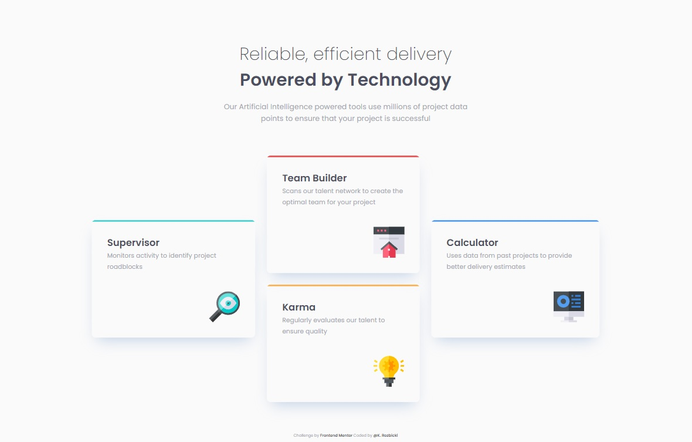

# Frontend Mentor - Four card feature section solution

https://krzysztofrozbicki.github.io/fem-challenge-12/

This is a solution to the [Four card feature section challenge on Frontend Mentor](https://www.frontendmentor.io/challenges/four-card-feature-section-weK1eFYK). Frontend Mentor challenges help you improve your coding skills by building realistic projects. 

## Table of contents

- [Overview](#overview)
  - [The challenge](#the-challenge)
  - [Screenshot](#screenshot)
  - [Links](#links)
- [My process](#my-process)
  - [Built with](#built-with)
  - [What I learned](#what-i-learned)
  - [Continued development](#continued-development)
  - [Useful resources](#useful-resources)
- [Author](#author)
- [Acknowledgments](#acknowledgments)

## Overview

### The challenge

Users should be able to:

- View the optimal layout for the site depending on their device's screen size

### Screenshot

### Links

- [Solution url](https://github.com/KrzysztofRozbicki/fem-challenge-12/)
- [Live site url](https://krzysztofrozbicki.github.io/fem-challenge-12/)

## My process

### Built with

- Semantic HTML5 markup
- CSS custom properties
- Flexbox
- Mobile-first workflow

### What I learned

It was simple challenge with flexbox, very good to practice the BEM method and SCSS (with all card with its small tweaks). Learned how to use the BEM naming more efficient and not to duplicate unnecessary code.

## Author

- GitHub - [GitHub](https://github.com/KrzysztofRozbicki)
- Website - [Pogbit](https://www.pogbit.com/)
- Frontend Mentor - [@KrzysztofRozbicki](https://www.frontendmentor.io/profile/KrzysztofRozbicki)

## Acknowledgments

Thanks goes to [GoIt](https://goit.global/pl/) for the great course where in just 12 weeks I have
learned almost full HTML/CSS so i can make these challenges without much struggle!
